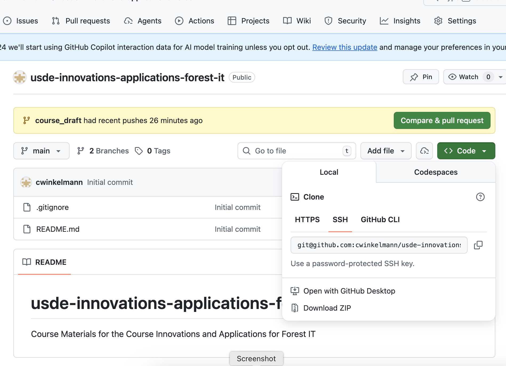
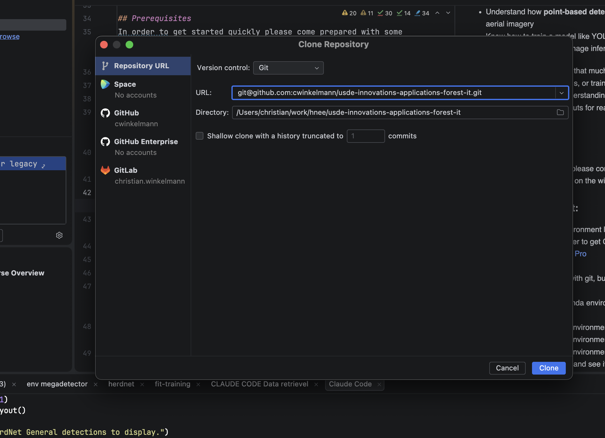

# Installation Instructions

It is recommended to use an IDE like VSCode or PyCharm for working with the codebase, but you can also run everything from the command line und jpyter notebooks if you prefer. Get the Pro version of PyCharm from here: https://www.jetbrains.com/help/pycharm/getting-started.html ( it is free as a student ). 

Clone this using your IDE or download the ZIP from GitHub and extract it to your desired location.



This course uses **three conda environments** to keep dependencies clean.
Start with the lightweight `fit-megadetector` environment for the first practicals and install the others as needed.

---

## Prerequisites

- [Miniconda](https://docs.conda.io/en/latest/miniconda.html) or Anaconda
- ~10 GB free disk space for both environments + datasets

---

## 1 — `fit-megadetector` (Practicals 1–2, data exploration)

Lightweight environment for dataset exploration, downloading, and basic
MegaDetector inference via megadetector package. **Do this before Day 1.**

```bash
conda env create -f environment-megadetector.yml
conda activate fit-megadetector

# update if necessary
conda env update -f environment-megadetector.yml --prune
# delete if necessary:
conda deactivate
conda env remove -n fit-megadetector -y
```

```bash
python -c "
import megadetector
print('fit-megadetector OK')
"
```

Run the notebooks
```bash
jupyter lab 
```

Verify, run the notebook practical_3_megadetector_legacy.ipynb, and check that the MegaDetector model downloads and runs:

---

## 2 — `fit-training` (Practicals 3–8, full training pipeline)

Adds ultralytics (YOLOv8/v11), SAHI tiled inference, timm classifiers,

```bash
conda env create -f environment-training.yml
conda activate fit-training
conda env update -f environment-training.yml --prune

# delete if necessary:
conda deactivate
conda env remove -n fit-training -y
```

Verify:
```bash
python -c "
import ultralytics, sahi, timm
print('fit-training OK')
"
```


---

## 3 — `fit-herdnet` (HerdNet training & geospatial pipeline)

This is the only environment that needs GDAL and the geospatial stack.

```bash
conda env create -f environment-herdnet.yml
conda activate fit-herdnet

# HerdNet (animaloc) must be cloned and installed separately
git clone https://github.com/cwinkelmann/HerdNet.git
pip install -e ./HerdNet
```

Verify:
```bash
python -c "
import animaloc
from animaloc.models import HerdNet
from wildlife_detection.training.herdnet import HerdNetDataset
print(f'fit-herdnet OK  (animaloc {animaloc.__version__})')
"
```


---


See `DATASETS.md` for a full description of each dataset and where it is used.

---

## Installing `wildlife-detection` (this project)

`pip install -e "."` installs the `wildlife_detection` Python package in
editable mode from `pyproject.toml`. This makes the tiling utilities, training
helpers, and config loader importable from any notebook or script.

Optional extras defined in `pyproject.toml`:

```bash
pip install -e ".[megadetector,dev]"   # fit-megadetector (P1–P2)
pip install -e ".[training,dev]"      # fit-training (P3–P8)
pip install -e ".[herdnet,dev]"       # fit-herdnet (HerdNet pipeline)
```


**Label Studio won't start**
```bash
label-studio start              # default port 8080
label-studio start --port 8081  # if 8080 is busy
```
On Windows, run in a standard terminal, not WSL.
